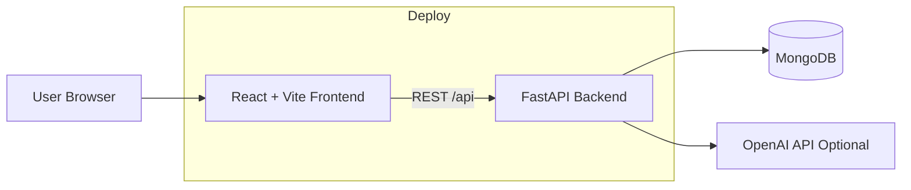
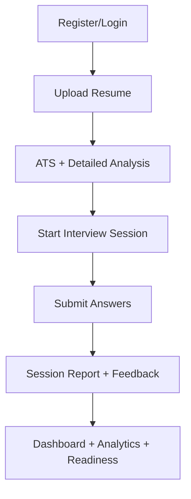

# AI-Powered Interview Simulation and Resume Intelligence


A full-stack career preparation platform where users can:

- practice role-based interview sessions,
- get AI-powered resume analysis and ATS scoring,
- track growth through dashboard and analytics insights.

This project was migrated from a .NET backend to a Python FastAPI backend while preserving core behavior and improving deployment readiness.

## Visual Preview


### Architecture Diagram



### Core User Flow



## Feature Highlights

- Authentication and security:
   - JWT access + refresh token flow
   - logout/logout-all
   - password change + reset flow
- Resume intelligence:
   - PDF/DOCX/TXT upload and parsing
   - ATS-style scoring
   - strengths, missing skills, and recommendations
   - detailed and keyword-level analysis
- Interview simulator:
   - role-based session generation
   - per-answer scoring with deterministic rubric
   - optional AI-enhanced generation/evaluation
   - full session report and history
- Analytics and readiness:
   - trend lines, performance by role, and history
   - resume + interview combined insights
   - interview readiness score and gap summaries

## Tech Stack

### Frontend

- React 18
- Vite
- Tailwind CSS
- React Router
- Axios
- Chart.js + react-chartjs-2
- react-hot-toast

### Backend

- FastAPI
- Uvicorn
- PyMongo (MongoDB)
- python-jose (JWT)
- passlib
- pypdf + python-docx
- httpx (OpenAI)

## Repository Structure

```text
net/
   frontend/              # React + Vite UI
   MyWebApiPython/        # FastAPI backend
   render.yaml            # Render Blueprint (frontend + backend)
   README.md
```

## Local Setup

### Prerequisites

- Node.js 18+
- Python 3.11+
- MongoDB Atlas (recommended) or local MongoDB

### Backend

```bash
cd MyWebApiPython
python -m venv .venv
.venv\Scripts\activate
pip install -r requirements.txt
```

Create a `.env` file in `MyWebApiPython`:

```env
MONGODB_CONNECTION_STRING=
MONGODB_DATABASE_NAME=AiInterviewDb

JWT_SECRET=
JWT_ISSUER=AIInterviewSimulator
JWT_AUDIENCE=AIInterviewSimulatorUsers
JWT_EXPIRY_MINUTES=120

OPENAI_API_KEY=
OPENAI_BASE_URL=https://api.openai.com/v1/
OPENAI_MODEL=gpt-4o-mini

# Optional production CORS values
CORS_ALLOWED_ORIGINS=http://localhost:3000,http://localhost:5173
CORS_ALLOWED_ORIGIN_REGEX=https://.*\.onrender\.com$
```

Run backend:

```bash
uvicorn main:app --host 0.0.0.0 --port 5107 --reload
```

### Frontend

```bash
cd frontend
npm install
npm run dev
```

The local frontend runs on `http://localhost:3000` and proxies API to `http://localhost:5107`.

## API Overview

Base path: `/api`

- Auth
   - `POST /auth/register`
   - `POST /auth/login`
   - `POST /auth/refresh-token`
   - `POST /auth/logout`
   - `GET /auth/profile`
   - `PUT /auth/profile`
- Resume
   - `POST /resume/upload`
   - `GET /resume/my`
   - `GET /resume/{resume_id}/detailed-analysis`
   - `POST /resume/{resume_id}/keyword-analysis`
- Interview
   - `POST /interview/simulator/start`
   - `POST /interview/simulator/submit`
   - `GET /interview/simulator/history`
   - `GET /interview/simulator/trends`
   - `GET /interview/readiness`

Backend docs:

- `/docs`

## Deployment (Render)

This repo includes [render.yaml](render.yaml) for Blueprint deployment.

### Steps

1. Push code to GitHub.
2. In Render: New -> Blueprint -> select this repository.
3. Render creates:
    - backend web service
    - frontend static site
4. Set backend environment variables:
    - `MONGODB_CONNECTION_STRING`
    - `JWT_SECRET`
    - `OPENAI_API_KEY` (optional)
    - `CORS_ALLOWED_ORIGINS` (your frontend URL)
5. Set frontend environment variable:
    - `VITE_API_URL=https://<your-backend>.onrender.com`

Note: frontend auto-normalizes `VITE_API_URL` to include `/api`, so you can provide backend base URL directly.

## Scripts

Frontend scripts from [frontend/package.json](frontend/package.json):

- `npm run dev`
- `npm run build`
- `npm run lint`
- `npm run preview`

## Troubleshooting

- Refresh sends users to login on deployed frontend:
   - verify `VITE_API_URL`
   - verify `CORS_ALLOWED_ORIGINS`
- CORS blocked in browser console:
   - include exact frontend domain in backend CORS env var
- ATS/dashboard data missing in deployment:
   - confirm backend URL and `/api` routing
   - check backend logs for auth or CORS failures

## Roadmap

- Add CI checks for build/lint/tests
- Improve analytics drill-down by role/topic
- Add admin insights and exportable reports
- Add richer AI prompt controls for interviewer modes

## License

For educational and portfolio use. Add a formal license for production/commercial distribution.
